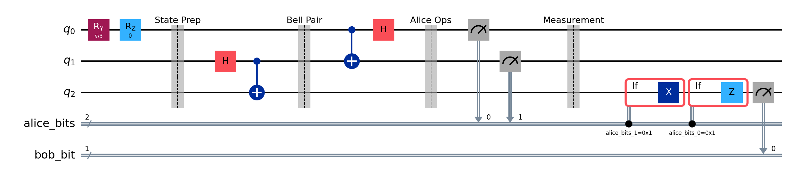
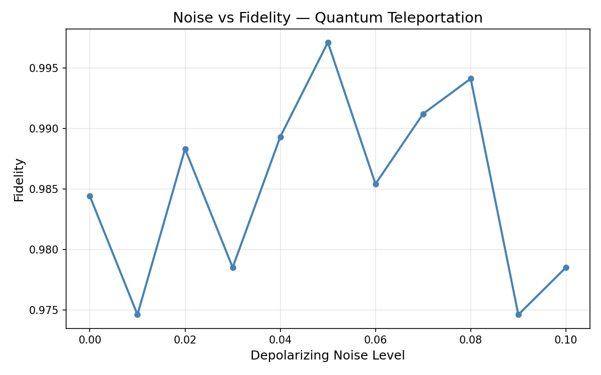
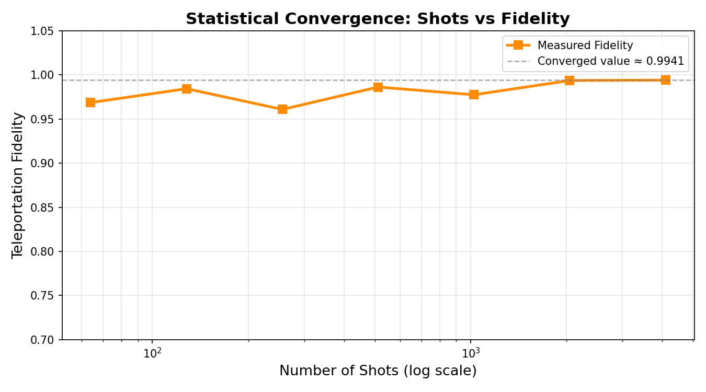
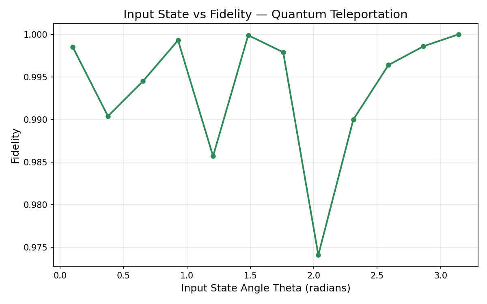

# Quantum Teleportation Fidelity



## Overview

Quantum teleportation is one of those ideas that sounds impossible until
you actually work through the math — and then it sounds even more
impossible. The idea that you can transfer a quantum state from one qubit
to another using only entanglement and two classical bits, without ever
directly sending the qubit itself, is genuinely wild.

This project implements the teleportation protocol from scratch using
Qiskit, simulates it under realistic noise conditions, and measures how
well the protocol preserves quantum states.

## Problem Statement

How does depolarizing noise affect teleportation fidelity?  
Does the protocol remain reliable across different input states, or does
performance vary depending on the state being teleported?

## Method

The experiment uses a **3-qubit teleportation circuit**:

- **q0**: payload qubit prepared by Alice  
- **q1**: Alice’s half of a Bell pair  
- **q2**: Bob’s half of the Bell pair  

Alice entangles the payload with her Bell qubit, measures both, and
sends two classical bits to Bob. Bob then applies conditional corrections
(X and Z) to reconstruct the state.

### Setup

- **Circuit:** 3-qubit teleportation circuit  
- **Simulator:** Qiskit Aer  
- **Noise model:** Depolarizing noise applied to all gates  
- **Metric:** Approximate fidelity computed from measurement probabilities

## Experiments

Three parameter sweeps were performed.

| Experiment | Parameter Varied | Range |
|---|---|---|
| Noise sweep | Depolarizing probability | 0.00 → 0.30 |
| Shot sweep | Number of measurements | 64 → 4096 |
| State sweep | Input rotation θ | 0.1 → π |

---

## Results

### Noise vs Fidelity

Under ideal conditions fidelity is essentially perfect (~0.999).  
As depolarizing noise increases the fidelity steadily drops.



---

### Shots vs Fidelity

Low shot counts lead to unstable estimates due to sampling noise.
Above ~512 shots the results stabilize near the expected value.



---

### Input State vs Fidelity

Fidelity remains consistently high across the tested range of θ values,
indicating that the teleportation protocol behaves independently of the
input state.



---

## Conclusion

Quantum teleportation works extremely well in ideal simulations, but
performance deteriorates as gate noise increases. Even small error rates
compound across the circuit, highlighting why error mitigation and
fault-tolerant architectures are essential for practical quantum
computing.

---

## How to Run

Install dependencies:

```bash
pip install -r requirements.txt
# Run the full experiment
python src/experiment.py

# Just view the circuit
python src/circuit.py
```

Results land in `results/data/` and plots in `results/plots/`.

## Stack
Python 3.10 · Qiskit 2.3.0 · Qiskit Aer · NumPy · Matplotlib · Pandas

## Notebook
View the interactive notebook:
[Open in nbviewer](https://nbviewer.org/github/topshe23/quantum-teleportation-fidelity/blob/main/notebooks/experiment.ipynb)